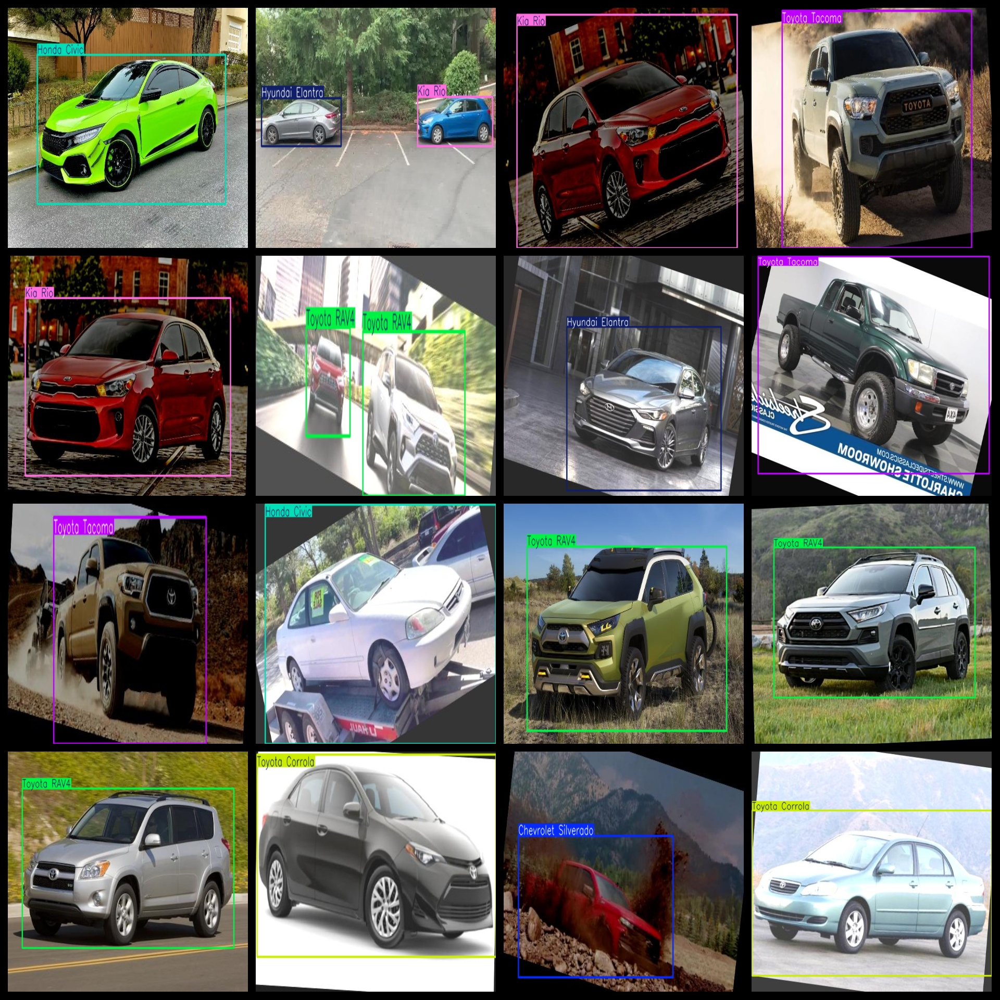

# Vehicle Brand Type Recognition Dataset 2788 Images VOC+YOLO format

The vehicle brand type recognition dataset consists of 2788 images in VOC+YOLO format. The dataset is divided into three folders: JPEGImages, Annotations, and labels.

In the JPEGImages folder, there are a total of 2788 JPEG images.

The Annotations folder contains a total of 2788 XML files.

The labels folder has a total of 2788 text files.

The number of label categories is 10.

The label names are as follows: ["Chevrolet Silverado", "Ford F-Series", "Honda CR-V", "Honda Civic", "Hyundai Elantra", "Kia Rio", "RAM 1500-2500-3500", "Toyota Corrola", "Toyota RAV4", "Toyota Tacoma"].

The number of bounding boxes (notice that the yolo format category order does not match this, but rather, the classes.txt in the labels folder) for each label is as follows:

Chevrolet Silverado bounding box count = 272

Ford F-Series bounding box count = 363

Honda CR-V bounding box count = 307

Honda Civic bounding box count = 373

Hyundai Elantra bounding box count = 384

Kia Rio bounding box count = 348

RAM 1500-2500-3500 bounding box count = 272

Toyota Corrola bounding box count = 302

Toyota RAV4 bounding box count = 354

Toyota Tacoma bounding box count = 286

Total bounding box count = 3261

The image resolution is clear.

The images have been enhanced.

Label shapes are rectangle boxes for object detection recognition.

Important Note: No guarantee is made regarding the accuracy or reasonableness of the labeled models or weights used in this dataset. The dataset only provides accurate and reasonable annotations.

Annotation and image details are as follows:

## Images

---

Here is a pay link on Stripe (https://buy.stripe.com/3cs8yP7sY87d0vu9AB). Please contact me lonlonago@foxmail.com after funding $89, and I will send you a complete data files, thank you!

